<picture>
  <source media="(prefers-color-scheme: dark)" srcset="assets/header-dark.svg">
  
</picture>

  
  
  
  

Víctor Jean Pierre Mandujano Gutierrez. Senior software engineer and Tech Lead
with ten years building and leading production systems, now working agent
first: I run the whole development lifecycle (specification, implementation,
review, verification) with orchestrated AI agents, and I help engineering
teams adopt them within whatever policy their organization allows.

Geological engineer from UNI, which is why half my work sits in computational
geoscience and mining.

## Deep Skill

[**Deep Skill**](https://deepskill.space) is the company I founded and run as
an AI-native organization: a small senior team plus agents doing the work of a
much larger one. It has two lines of business.

<table>
<tr>
<td width="50%" valign="top">

### 🎓 Training

**A learning platform for science and engineering, with an AI coach.**

Structured paths in algorithms and data structures, mathematics, data science
(Python, SQL, data engineering, machine learning), AI-assisted software
development and system design. The AI coach follows each learner through
practice, feedback and progress, on top of instructors who are ICPC world
finalists and Google engineers.

For companies: **Corporate AI Programs**, intensive tracks that turn
developers, engineers and analysts into people who build with AI.

</td>
<td width="50%" valign="top">

### ⚙️ AI operations

**Automation and AI-supported operations for companies.**

**Turbo**, our AI software factory: agents orchestrated by senior engineers,
shipping in continuous increments instead of one-off projects.

Typical work: workflow and back-office automation, data pipelines and system
integrations, legacy modernization and migrations, and LLM features in
production with the evaluation, observability and guardrails they need to
stay there.

</td>
</tr>
</table>

Also Fractional Tech Lead at Rumbo. Before that: API Tech Lead and Engineering
Manager at Scotiabank's Digital Factory, and founder and CTO of Deep Pit
Technology, acquired by Stracon Tech.

## Open source, agent assisted

Every contribution below was specified, generated and reviewed by me before it
went upstream. The agents write; I own the design and the verification.

**Merged upstream**

<table>
<tr>
<th align="left" width="50%">Infrastructure and developer tooling</th>
<th align="left" width="50%">Computational geoscience</th>
</tr>
<tr>
<td valign="top">

 [kubernetes/website](https://github.com/kubernetes/website) · [#57031](https://github.com/kubernetes/website/pull/57031) 
Kubernetes documentation, Spanish localization

 [open-telemetry/opentelemetry.io](https://github.com/open-telemetry/opentelemetry.io) · [#10897](https://github.com/open-telemetry/opentelemetry.io/pull/10897) [#11344](https://github.com/open-telemetry/opentelemetry.io/pull/11344) 
OpenTelemetry documentation, Spanish localization

 [testcontainers/testcontainers-go](https://github.com/testcontainers/testcontainers-go) · [#3881](https://github.com/testcontainers/testcontainers-go/pull/3881) 
Integration testing with real dependencies in Go

 [falcosecurity/falcosidekick](https://github.com/falcosecurity/falcosidekick) · [#1415](https://github.com/falcosecurity/falcosidekick/pull/1415) 
Runtime security event routing, CNCF

 [dapr/java-sdk](https://github.com/dapr/java-sdk) · [#1790](https://github.com/dapr/java-sdk/pull/1790) 
Dapr distributed runtime SDK for Java

 [openrewrite/rewrite-testing-frameworks](https://github.com/openrewrite/rewrite-testing-frameworks) · [#1117](https://github.com/openrewrite/rewrite-testing-frameworks/pull/1117) 
Automated refactoring recipes for Java test migrations

 [czerwonk/ping_exporter](https://github.com/czerwonk/ping_exporter) · [#166](https://github.com/czerwonk/ping_exporter/pull/166) 
Prometheus ICMP exporter

</td>
<td valign="top">

 [simpeg/simpeg](https://github.com/simpeg/simpeg) · [#1777](https://github.com/simpeg/simpeg/pull/1777) 
Geophysical simulation and inversion

 [fatiando/harmonica](https://github.com/fatiando/harmonica) · [#695](https://github.com/fatiando/harmonica/pull/695) 
Gravity and magnetic data processing

 [fatiando/boule](https://github.com/fatiando/boule) · [#294](https://github.com/fatiando/boule/pull/294) 
Reference ellipsoids for geodesy and geophysics

 [seisbench/seisbench](https://github.com/seisbench/seisbench) · [#435](https://github.com/seisbench/seisbench/pull/435) 
Machine learning for seismology

 [GlacioHack/xdem](https://github.com/GlacioHack/xdem) · [#993](https://github.com/GlacioHack/xdem/pull/993) 
Digital elevation model analysis

 [Loop3D/LoopStructural](https://github.com/Loop3D/LoopStructural) · [#293](https://github.com/Loop3D/LoopStructural/pull/293) 
3D structural geological modelling

</td>
</tr>
</table>

**Not merged, but the fix that landed builds on them**

 [prometheus/client_java](https://github.com/prometheus/client_java) · [#2316](https://github.com/prometheus/client_java/pull/2316) → [#2396](https://github.com/prometheus/client_java/pull/2396) 
Summary quantiles collapsing to the minimum: the merged fix shares this PR's two-part diagnosis, the <code>compress()</code> merge bound and the early-stopping scan in <code>get()</code>

 [DASDAE/dascore](https://github.com/DASDAE/dascore) · [#927](https://github.com/DASDAE/dascore/pull/927) → [#1290](https://github.com/DASDAE/dascore/pull/1290) 
Times outside the nanosecond range: the maintainer's smaller fix reuses this PR's test cases and credits it

**In review**

apache/lucene [#16643](https://github.com/apache/lucene/pull/16643) ·
keycloak/keycloak [#52478](https://github.com/keycloak/keycloak/pull/52478) ·
OpenAPITools/openapi-generator [#25073](https://github.com/OpenAPITools/openapi-generator/pull/25073) [#25074](https://github.com/OpenAPITools/openapi-generator/pull/25074) ·
wailsapp/wails [#6205](https://github.com/wailsapp/wails/pull/6205) [#6206](https://github.com/wailsapp/wails/pull/6206) ·
moghtech/komodo [#1661](https://github.com/moghtech/komodo/pull/1661) [#1662](https://github.com/moghtech/komodo/pull/1662) ·
Automattic/harper [#4425](https://github.com/Automattic/harper/pull/4425) ·
dapr/python-sdk [#1210](https://github.com/dapr/python-sdk/pull/1210) ·
testcontainers-java [#12072](https://github.com/testcontainers/testcontainers-java/pull/12072) ·
torchgeo [#4111](https://github.com/microsoft/torchgeo/pull/4111) ·
gempy [#1110](https://github.com/gempy-project/gempy/pull/1110) ·
fatiando/harmonica [#698](https://github.com/fatiando/harmonica/pull/698)

I also review upstream, not just submit: testcontainers-go and dascore among
others.

## How the work gets found

[**open-source-builder**](https://github.com/manduinca/open-source-builder) is
the agentic system behind the list above. Claude Code agents scan GitHub for
active projects in my domains, filter issues by maintainer responsiveness, AI
policy and real reproducibility, and hand me a curated report. The
contributions are the output; this is the method.

## Stack

  
  
  
  
  
  
  
  
  

